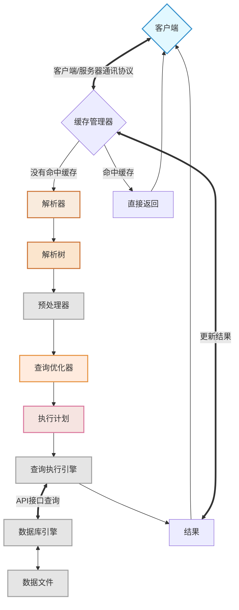

# Mysql语句执行流程

```mermaid
graph TB
    style S fill:#e2f8ff,stroke:#3591cd,stroke-width:2px;

    style 解析器 fill:#f9ebdd,stroke:#cd7639,stroke-width:2px;
    style 解析树 fill:#fbe5cd,stroke:#cd7639,stroke-width:2px;
    style 预处理器 fill:#e5e5e5,stroke:#a2a2a2,stroke-width:2px;

    style 查询优化器 fill:#ffebde,stroke:#e69240,stroke-width:2px;
    style 执行计划 fill:#f6e4e1,stroke:#db799f,stroke-width:2px;
    style 查询执行引擎 fill:#e5e5e5,stroke:#a2a2a2,stroke-width:2px;
    style 数据库引擎 fill:#e5e5e5,stroke:#a2a2a2,stroke-width:2px;
    style 数据文件 fill:#e5e5e5,stroke:#a2a2a2,stroke-width:2px;

    S{客户端} <==客户端/服务器通讯协议==> c{缓存管理器}
    c-->|没有命中缓存|解析器-->解析树-->预处理器-->查询优化器-->执行计划-->查询执行引擎  
    c-->|命中缓存|直接返回-->S  

    查询执行引擎<==API接口查询==>数据库引擎<-->数据文件
    查询执行引擎-->结果-->S
    结果<==更新结果==>c


```
