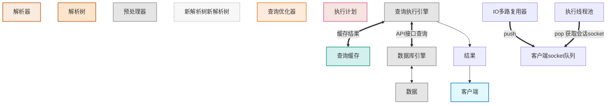

# Mysql语句执行流程

```mermaid
graph TB
    style 客户端 fill:#e2f8ff,stroke:#3591cd,stroke-width:2px;
    style 查询缓存 fill:#d3f0ef,stroke:#37a593,stroke-width:2px;
    style 解析器 fill:#f9ebdd,stroke:#cd7639,stroke-width:2px;
    style 解析树 fill:#fbe5cd,stroke:#cd7639,stroke-width:2px;
    style 预处理器 fill:#e5e5e5,stroke:#a2a2a2,stroke-width:2px;
    style 新解析树新解析树 fill:#f7f7f7,stroke:#d9d9d9,stroke-width:2px;
    style 查询优化器 fill:#ffebde,stroke:#e69240,stroke-width:2px;
    style 执行计划 fill:#f6e4e1,stroke:#db799f,stroke-width:2px;
    style 查询执行引擎 fill:#e5e5e5,stroke:#a2a2a2,stroke-width:2px;
    style 数据库引擎 fill:#e5e5e5,stroke:#a2a2a2,stroke-width:2px;
    style 数据 fill:#e5e5e5,stroke:#a2a2a2,stroke-width:2px;

    IO多路复用器 == push==> 客户端socket队列

    执行线程池==pop 获取会话socket==>客户端socket队列

    查询执行引擎<==缓存结果==>查询缓存
    查询执行引擎<==API接口查询==>数据库引擎<-->数据
    查询执行引擎-->结果-->客户端


```
